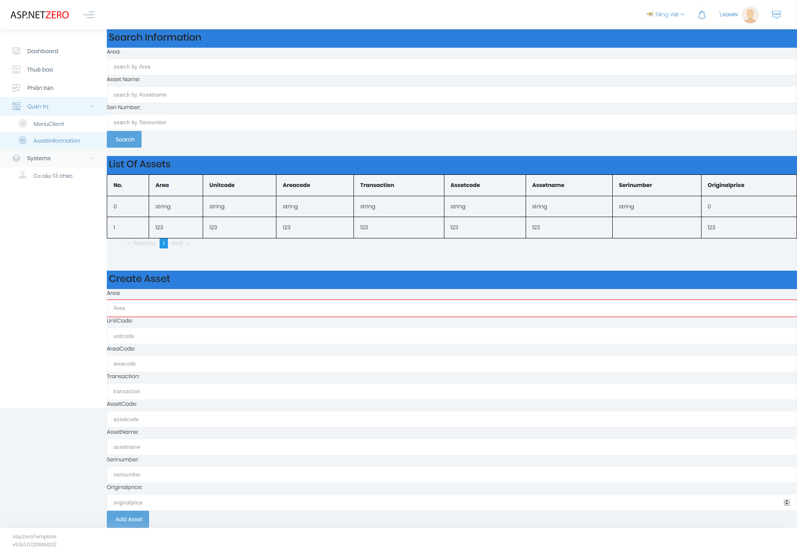
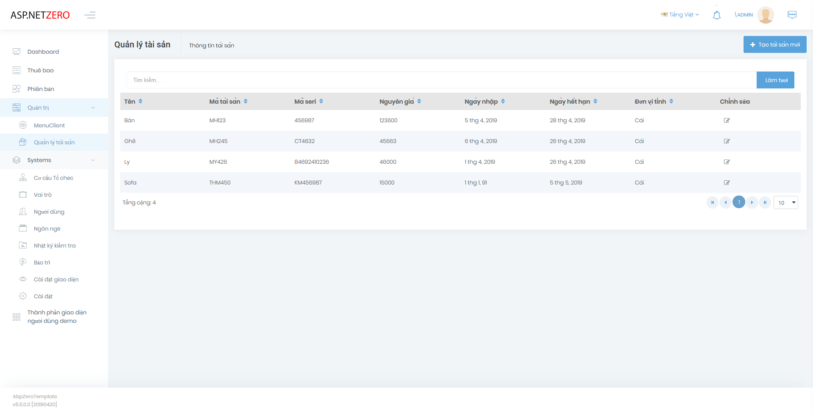
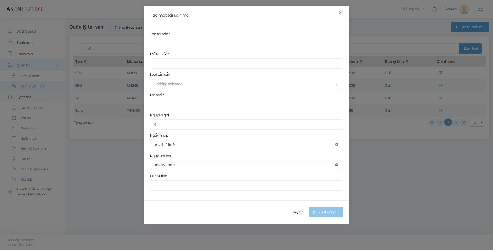
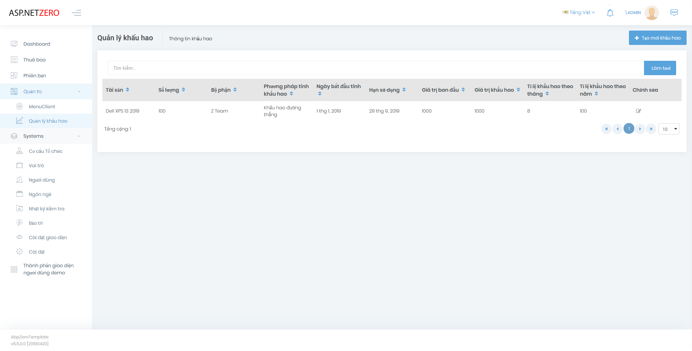
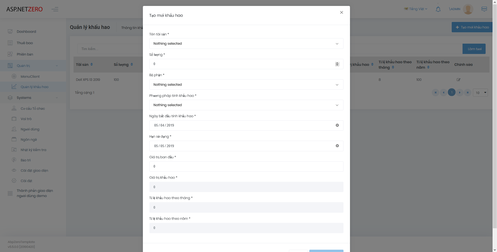

# Quản lý tài sản
Đồ án quản lý tài sản cá nhân:
- ASP.NET
- Angular

## Nội dung chính
- [Các màn hình](#các-màn-hình)
- [Cách cài đặt](#cách-cài-đặt)
- [Nhóm thực hiện](#nhóm-thực-hiện)
- [Báo cáo lỗi](#báo-cáo-lỗi)
- [Bản quyền](#bản-quyền)
## Các màn hình

Màn hình quản lý thông tin tài sản của [Đạt](https://github.com/NTD98):

Màn hình quản lý thông tin tài sản của [Thiện](https://github.com/tvc12):

Màn hình thêm thông tin tài sản:

Màn hình khấu hao tài sản của [Cương](https://github.com/cuongw):

Màn hình thêm mới khấu hao:

## Cách cài đặt
## Nhóm thực hiện
|  |  |  |
| :---: | :---: | :---: |
| [Nguyễn Tiến Đạt](https://github.com/NTD98) | [Vi Chí Thiện](https://github.com/tvc12) | [Nguyễn Duy Cương](https://github.com/cuongw) | 
| [16520199](https://github.com/NTD98) | [16521169](https://github.com/tvc12) | [16520147](https://github.com/cuongw) |
## Báo cáo lỗi
Có vấn đề về bug hoặc muốn tìm hiểu về đồ án. Mở ngay issues [tại đây.](https://github.com/NTD98/ASP_ANGULAR/issues/new) 
## Bản quyền
[Apache License 2.0](https://github.com/NTD98/ASP_ANGULAR/blob/master/LICENSE)
